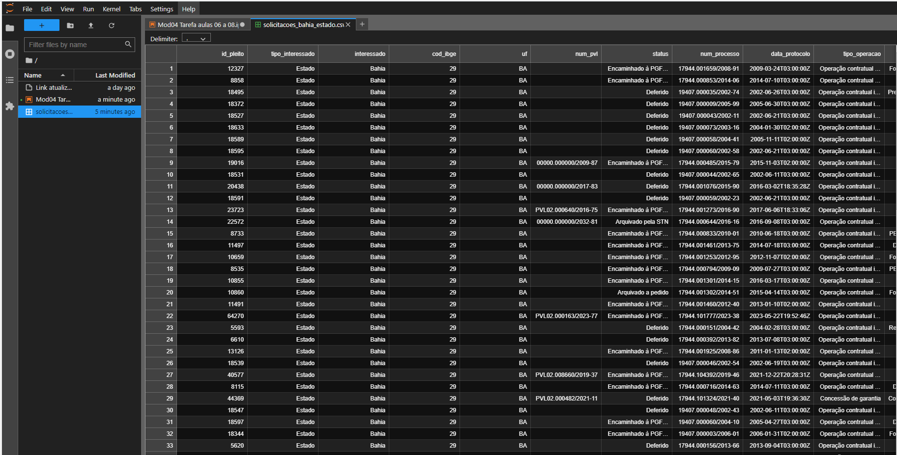

# Tarefa 03

- Leia os enunciados com atenção
- Saiba que pode haver mais de uma resposta correta
- Insira novas células de código sempre que achar necessário
- Em caso de dúvidas, procure os Tutores
- Divirta-se :)


```python
import pandas as pd
import requests
```

####  1) Lendo de APIs
Vimos em aula como carregar dados públicos do governo através de um API (*Application Programming Interface*). No exemplo de aula, baixamos os dados de pedidos de verificação de limites (PVL) realizados por estados, e selecionamos apenas aqueles referentes ao estado de São Paulo.

1. Repita os mesmos passos feitos em aula, mas selecione os PVLs realizados por municípios no estado do Rio de Janeiro.
2. Quais são os três *status* das solicitações mais frequentes na base? Quais são suas frequências?
3. Construa uma nova variável que contenha o ano do **status**. Observe que ```data_status``` vem como tipo *object* no **DataFrame**. Dica: você pode usar o método ```.str``` para transformar o tipo da variável em string, em seguida um método como [**slice()**](https://pandas.pydata.org/docs/reference/api/pandas.Series.str.slice.html) ou [**split()**](https://pandas.pydata.org/pandas-docs/stable/reference/api/pandas.Series.str.split.html).
4. Indique a frequência de cada ano do campo construído no item (3).


```python
# 1) Repita os mesmos passos feitos em aula, mas selecione os PVLs realizados por municípios no estado do Rio de Janeiro.
num_rj = requests.get(
    url = 'https://apidatalake.tesouro.gov.br/ords/sadipem/tt/pvl?uf=RJ&tipo_interessado=Munic%C3%ADpio')
num_rj.status_code
```


    200


```python
# Criando um DataFrame que está recebendo um objeto Json da variavel nun_rj e transformando essa lista de dicionários em uma estrutura de dados semelhante a uma tabela com colunas e linhas.
df_num_rj = pd.DataFrame(num_rj.json()['items'])
df_num_rj.head()
```


<div>

<table border="1" class="dataframe">
  <thead>
    <tr style="text-align: right;">
      <th></th>
      <th>id_pleito</th>
      <th>tipo_interessado</th>
      <th>interessado</th>
      <th>cod_ibge</th>
      <th>uf</th>
      <th>num_pvl</th>
      <th>status</th>
      <th>num_processo</th>
      <th>data_protocolo</th>
      <th>tipo_operacao</th>
      <th>finalidade</th>
      <th>tipo_credor</th>
      <th>credor</th>
      <th>moeda</th>
      <th>valor</th>
      <th>pvl_assoc_divida</th>
      <th>pvl_contradado_credor</th>
      <th>data_status</th>
    </tr>
  </thead>
  <tbody>
    <tr>
      <th>0</th>
      <td>6981</td>
      <td>Município</td>
      <td>Rio de Janeiro</td>
      <td>3304557</td>
      <td>RJ</td>
      <td>None</td>
      <td>Deferido</td>
      <td>17944.000472/2007-90</td>
      <td>2007-04-30T03:00:00Z</td>
      <td>Operação contratual interna</td>
      <td>Saneamento básico</td>
      <td>Instituição Financeira Nacional</td>
      <td>Caixa Econômica Federal</td>
      <td>Real</td>
      <td>7403640.0</td>
      <td>1</td>
      <td>0</td>
      <td>25/05/2007</td>
    </tr>
    <tr>
      <th>1</th>
      <td>7993</td>
      <td>Município</td>
      <td>Rio Claro</td>
      <td>3304409</td>
      <td>RJ</td>
      <td>None</td>
      <td>Deferido</td>
      <td>17944.000691/2010-74</td>
      <td>2011-06-01T03:00:00Z</td>
      <td>Operação contratual interna</td>
      <td>Caminho da Escola 2009 A</td>
      <td>Instituição Financeira Nacional</td>
      <td>Banco do Brasil S/A</td>
      <td>Real</td>
      <td>584500.0</td>
      <td>0</td>
      <td>0</td>
      <td>22/07/2011</td>
    </tr>
    <tr>
      <th>2</th>
      <td>8005</td>
      <td>Município</td>
      <td>Paraíba do Sul</td>
      <td>3303708</td>
      <td>RJ</td>
      <td>None</td>
      <td>Arquivado por decurso de prazo</td>
      <td>17944.000693/2014-97</td>
      <td>2015-02-18T02:00:00Z</td>
      <td>Operação contratual interna</td>
      <td>PAC 2 - Pró-Transporte - Pavimentação e Qualif...</td>
      <td>Instituição Financeira Nacional</td>
      <td>Caixa Econômica Federal</td>
      <td>Real</td>
      <td>5800000.0</td>
      <td>0</td>
      <td>0</td>
      <td>25/03/2015</td>
    </tr>
    <tr>
      <th>3</th>
      <td>13440</td>
      <td>Município</td>
      <td>Rio de Janeiro</td>
      <td>3304557</td>
      <td>RJ</td>
      <td>None</td>
      <td>Deferido</td>
      <td>19405.000001/2004-61</td>
      <td>2004-02-26T03:00:00Z</td>
      <td>Operação contratual interna</td>
      <td>PMAT</td>
      <td>Instituição Financeira Nacional</td>
      <td>Banco Nacional de Desenvolvimento Econômico e ...</td>
      <td>Real</td>
      <td>10420000.0</td>
      <td>1</td>
      <td>0</td>
      <td>04/03/2004</td>
    </tr>
    <tr>
      <th>4</th>
      <td>5618</td>
      <td>Município</td>
      <td>Nova Iguaçu</td>
      <td>3303500</td>
      <td>RJ</td>
      <td>None</td>
      <td>Arquivado</td>
      <td>17944.000156/2010-13</td>
      <td>2010-12-03T02:00:00Z</td>
      <td>Operação contratual interna</td>
      <td>PAC - Saneamento - 2009 A</td>
      <td>Instituição Financeira Nacional</td>
      <td>Caixa Econômica Federal</td>
      <td>Real</td>
      <td>60737300.0</td>
      <td>0</td>
      <td>0</td>
      <td>15/12/2010</td>
    </tr>
  </tbody>
</table>
</div>


```python
# Últimas 5 linhas da estrutura de dados.
df_num_rj.tail()
```


<div>

<table border="1" class="dataframe">
  <thead>
    <tr style="text-align: right;">
      <th></th>
      <th>id_pleito</th>
      <th>tipo_interessado</th>
      <th>interessado</th>
      <th>cod_ibge</th>
      <th>uf</th>
      <th>num_pvl</th>
      <th>status</th>
      <th>num_processo</th>
      <th>data_protocolo</th>
      <th>tipo_operacao</th>
      <th>finalidade</th>
      <th>tipo_credor</th>
      <th>credor</th>
      <th>moeda</th>
      <th>valor</th>
      <th>pvl_assoc_divida</th>
      <th>pvl_contradado_credor</th>
      <th>data_status</th>
    </tr>
  </thead>
  <tbody>
    <tr>
      <th>247</th>
      <td>5843</td>
      <td>Município</td>
      <td>Maricá</td>
      <td>3302700</td>
      <td>RJ</td>
      <td>None</td>
      <td>Arquivado</td>
      <td>17944.000212/2010-10</td>
      <td>2010-11-30T02:00:00Z</td>
      <td>Operação contratual interna</td>
      <td>PAC - Pró-Moradia - 2009</td>
      <td>Instituição Financeira Nacional</td>
      <td>Caixa Econômica Federal</td>
      <td>Real</td>
      <td>51016091.98</td>
      <td>0</td>
      <td>0</td>
      <td>28/12/2010</td>
    </tr>
    <tr>
      <th>248</th>
      <td>5864</td>
      <td>Município</td>
      <td>Duas Barras</td>
      <td>3301603</td>
      <td>RJ</td>
      <td>None</td>
      <td>Arquivado</td>
      <td>17944.000218/2008-72</td>
      <td>2008-04-14T03:00:00Z</td>
      <td>Operação contratual interna</td>
      <td>Caminho da Escola</td>
      <td>Instituição Financeira Nacional</td>
      <td>Banco do Brasil S/A</td>
      <td>Real</td>
      <td>179900.00</td>
      <td>0</td>
      <td>0</td>
      <td>06/05/2008</td>
    </tr>
    <tr>
      <th>249</th>
      <td>6495</td>
      <td>Município</td>
      <td>Itaboraí</td>
      <td>3301900</td>
      <td>RJ</td>
      <td>None</td>
      <td>Arquivado por decurso de prazo</td>
      <td>17944.000367/2012-18</td>
      <td>2012-03-09T03:00:00Z</td>
      <td>Operação contratual interna</td>
      <td>RELUZ</td>
      <td>Empresa Estatal</td>
      <td>Furnas Centrais Elétricas S/A</td>
      <td>Real</td>
      <td>8187062.20</td>
      <td>0</td>
      <td>0</td>
      <td>22/01/2013</td>
    </tr>
    <tr>
      <th>250</th>
      <td>6568</td>
      <td>Município</td>
      <td>Rio de Janeiro</td>
      <td>3304557</td>
      <td>RJ</td>
      <td>None</td>
      <td>Deferido</td>
      <td>17944.000382/2006-18</td>
      <td>2007-04-30T03:00:00Z</td>
      <td>Operação contratual interna</td>
      <td>Saneamento básico</td>
      <td>Instituição Financeira Nacional</td>
      <td>Caixa Econômica Federal</td>
      <td>Real</td>
      <td>23201946.29</td>
      <td>1</td>
      <td>0</td>
      <td>25/05/2007</td>
    </tr>
    <tr>
      <th>251</th>
      <td>7062</td>
      <td>Município</td>
      <td>Nova Iguaçu</td>
      <td>3303500</td>
      <td>RJ</td>
      <td>None</td>
      <td>Arquivado por decurso de prazo</td>
      <td>17944.000489/2007-47</td>
      <td>2010-12-03T02:00:00Z</td>
      <td>Operação contratual externa (com garantia da U...</td>
      <td>Multissetorial</td>
      <td>Instituição Financeira Internacional</td>
      <td>Banco Interamericano de Desenvolvimento</td>
      <td>Dólar dos EUA</td>
      <td>34500000.00</td>
      <td>0</td>
      <td>0</td>
      <td>26/04/2012</td>
    </tr>
  </tbody>
</table>
</div>


```python
# Iformações sobre o DataFrame
df_num_rj.info()
```

    <class 'pandas.core.frame.DataFrame'>
    RangeIndex: 252 entries, 0 to 251
    Data columns (total 18 columns):
     #   Column                 Non-Null Count  Dtype  
    ---  ------                 --------------  -----  
     0   id_pleito              252 non-null    int64  
     1   tipo_interessado       252 non-null    object 
     2   interessado            252 non-null    object 
     3   cod_ibge               252 non-null    int64  
     4   uf                     252 non-null    object 
     5   num_pvl                75 non-null     object 
     6   status                 252 non-null    object 
     7   num_processo           230 non-null    object 
     8   data_protocolo         230 non-null    object 
     9   tipo_operacao          252 non-null    object 
     10  finalidade             252 non-null    object 
     11  tipo_credor            252 non-null    object 
     12  credor                 252 non-null    object 
     13  moeda                  252 non-null    object 
     14  valor                  252 non-null    float64
     15  pvl_assoc_divida       252 non-null    int64  
     16  pvl_contradado_credor  252 non-null    int64  
     17  data_status            252 non-null    object 
    dtypes: float64(1), int64(4), object(13)
    memory usage: 35.6+ KB
    


```python
df_num_rj['uf'].value_counts()
```


    RJ    252
    Name: uf, dtype: int64


```python
# Fiz essa analise para gerar contagem dos status atual dos processos da distribuição dos pleitos.
df_num_rj_distribution = df_num_rj['status'].value_counts().reset_index()
df_num_rj_distribution.columns = ['Status', 'Contagem']
```


```python
df_num_rj_distribution
```


<div>

<table border="1" class="dataframe">
  <thead>
    <tr style="text-align: right;">
      <th></th>
      <th>Status</th>
      <th>Contagem</th>
    </tr>
  </thead>
  <tbody>
    <tr>
      <th>0</th>
      <td>Deferido</td>
      <td>99</td>
    </tr>
    <tr>
      <th>1</th>
      <td>Arquivado</td>
      <td>53</td>
    </tr>
    <tr>
      <th>2</th>
      <td>Regularizado</td>
      <td>26</td>
    </tr>
    <tr>
      <th>3</th>
      <td>Arquivado por decurso de prazo</td>
      <td>24</td>
    </tr>
    <tr>
      <th>4</th>
      <td>Deferido (PVL-IF)</td>
      <td>21</td>
    </tr>
    <tr>
      <th>5</th>
      <td>Encaminhado à PGFN com manifestação técnica fa...</td>
      <td>14</td>
    </tr>
    <tr>
      <th>6</th>
      <td>Arquivado a pedido</td>
      <td>6</td>
    </tr>
    <tr>
      <th>7</th>
      <td>Em retificação pelo interessado</td>
      <td>4</td>
    </tr>
    <tr>
      <th>8</th>
      <td>Em retificação pelo credor</td>
      <td>2</td>
    </tr>
    <tr>
      <th>9</th>
      <td>Em análise</td>
      <td>1</td>
    </tr>
    <tr>
      <th>10</th>
      <td>Arquivado pela STN</td>
      <td>1</td>
    </tr>
    <tr>
      <th>11</th>
      <td>Em retificação pelo interessado (PVL-IF)</td>
      <td>1</td>
    </tr>
  </tbody>
</table>
</div>


```python
# Observando a distribuição de status dos pleitos em termos de percentagem.
# Nessa váriavel usei a função lambda para formatar.

contagem_por_status_percentagem = (df_num_rj['status'].value_counts(normalize=True) * 100).round(2)
contagem_por_status_percentagem = contagem_por_status_percentagem.apply(lambda x: f"{x:.2f}%")
contagem_por_status_percentagem
```


    Deferido                                                 39.29%
    Arquivado                                                21.03%
    Regularizado                                             10.32%
    Arquivado por decurso de prazo                            9.52%
    Deferido (PVL-IF)                                         8.33%
    Encaminhado à PGFN com manifestação técnica favorável     5.56%
    Arquivado a pedido                                        2.38%
    Em retificação pelo interessado                           1.59%
    Em retificação pelo credor                                0.79%
    Em análise                                                0.40%
    Arquivado pela STN                                        0.40%
    Em retificação pelo interessado (PVL-IF)                  0.40%
    Name: status, dtype: object


```python
# 2) Quais são os três status das solicitações mais frequentes na base? Quais são suas frequências?
status_num_rj = df_num_rj.status.value_counts()

print('Status mais frequentes na base:\n')
for i in range(3):
    print(f'{i+1}º {status_num_rj.index[i]}: {status_num_rj[i]}')
```

    Status mais frequentes na base:
    
    1º Deferido: 99
    2º Arquivado: 53
    3º Regularizado: 26
    


```python
# 3) Construa uma nova variável que contenha o ano do status. Observe que data_status vem como tipo object no DataFrame. 
# Dica: você pode usar o método .str para transformar o tipo da variável em string, em seguida um método como slice() ou split().

# Converter a coluna 'data_status' para string métodp slice()
#df_num_rj['ano'] = df_nun_rj['data_status'].str.slice(start=-4)


# Método .str.split()
df_num_rj['ano'] = df_num_rj['data_status'].str.split('/').str[-1]


df_num_rj.head()
```


<div>

<table border="1" class="dataframe">
  <thead>
    <tr style="text-align: right;">
      <th></th>
      <th>id_pleito</th>
      <th>tipo_interessado</th>
      <th>interessado</th>
      <th>cod_ibge</th>
      <th>uf</th>
      <th>num_pvl</th>
      <th>status</th>
      <th>num_processo</th>
      <th>data_protocolo</th>
      <th>tipo_operacao</th>
      <th>finalidade</th>
      <th>tipo_credor</th>
      <th>credor</th>
      <th>moeda</th>
      <th>valor</th>
      <th>pvl_assoc_divida</th>
      <th>pvl_contradado_credor</th>
      <th>data_status</th>
      <th>ano</th>
    </tr>
  </thead>
  <tbody>
    <tr>
      <th>0</th>
      <td>6981</td>
      <td>Município</td>
      <td>Rio de Janeiro</td>
      <td>3304557</td>
      <td>RJ</td>
      <td>None</td>
      <td>Deferido</td>
      <td>17944.000472/2007-90</td>
      <td>2007-04-30T03:00:00Z</td>
      <td>Operação contratual interna</td>
      <td>Saneamento básico</td>
      <td>Instituição Financeira Nacional</td>
      <td>Caixa Econômica Federal</td>
      <td>Real</td>
      <td>7403640.0</td>
      <td>1</td>
      <td>0</td>
      <td>25/05/2007</td>
      <td>2007</td>
    </tr>
    <tr>
      <th>1</th>
      <td>7993</td>
      <td>Município</td>
      <td>Rio Claro</td>
      <td>3304409</td>
      <td>RJ</td>
      <td>None</td>
      <td>Deferido</td>
      <td>17944.000691/2010-74</td>
      <td>2011-06-01T03:00:00Z</td>
      <td>Operação contratual interna</td>
      <td>Caminho da Escola 2009 A</td>
      <td>Instituição Financeira Nacional</td>
      <td>Banco do Brasil S/A</td>
      <td>Real</td>
      <td>584500.0</td>
      <td>0</td>
      <td>0</td>
      <td>22/07/2011</td>
      <td>2011</td>
    </tr>
    <tr>
      <th>2</th>
      <td>8005</td>
      <td>Município</td>
      <td>Paraíba do Sul</td>
      <td>3303708</td>
      <td>RJ</td>
      <td>None</td>
      <td>Arquivado por decurso de prazo</td>
      <td>17944.000693/2014-97</td>
      <td>2015-02-18T02:00:00Z</td>
      <td>Operação contratual interna</td>
      <td>PAC 2 - Pró-Transporte - Pavimentação e Qualif...</td>
      <td>Instituição Financeira Nacional</td>
      <td>Caixa Econômica Federal</td>
      <td>Real</td>
      <td>5800000.0</td>
      <td>0</td>
      <td>0</td>
      <td>25/03/2015</td>
      <td>2015</td>
    </tr>
    <tr>
      <th>3</th>
      <td>13440</td>
      <td>Município</td>
      <td>Rio de Janeiro</td>
      <td>3304557</td>
      <td>RJ</td>
      <td>None</td>
      <td>Deferido</td>
      <td>19405.000001/2004-61</td>
      <td>2004-02-26T03:00:00Z</td>
      <td>Operação contratual interna</td>
      <td>PMAT</td>
      <td>Instituição Financeira Nacional</td>
      <td>Banco Nacional de Desenvolvimento Econômico e ...</td>
      <td>Real</td>
      <td>10420000.0</td>
      <td>1</td>
      <td>0</td>
      <td>04/03/2004</td>
      <td>2004</td>
    </tr>
    <tr>
      <th>4</th>
      <td>5618</td>
      <td>Município</td>
      <td>Nova Iguaçu</td>
      <td>3303500</td>
      <td>RJ</td>
      <td>None</td>
      <td>Arquivado</td>
      <td>17944.000156/2010-13</td>
      <td>2010-12-03T02:00:00Z</td>
      <td>Operação contratual interna</td>
      <td>PAC - Saneamento - 2009 A</td>
      <td>Instituição Financeira Nacional</td>
      <td>Caixa Econômica Federal</td>
      <td>Real</td>
      <td>60737300.0</td>
      <td>0</td>
      <td>0</td>
      <td>15/12/2010</td>
      <td>2010</td>
    </tr>
  </tbody>
</table>
</div>


```python
# 4) Indique a frequência de cada ano do campo construído no item (3).

frequencia_por_ano = df_num_rj['ano'].value_counts().sort_index()

frequencia_por_ano
```


    2002     4
    2003     1
    2004     1
    2006     4
    2007    29
    2008    37
    2009     9
    2010    19
    2011    10
    2012    13
    2013    15
    2014    20
    2015     8
    2016     4
    2017     5
    2018     4
    2019    17
    2020    15
    2021     5
    2022    11
    2023    21
    Name: ano, dtype: int64


Ao analisar os pleitos ao longo dos anos, é evidente que a frequência de determinados status varia. Essas variações podem ser interpretadas como reflexos de possíveis mudanças nas políticas, regulamentações ou eventos econômicos que afetaram a natureza dos pleitos. Essa análise temporal é valiosa para compreender como fatores externos influenciam a dinâmica dos pleitos ao longo do tempo, o que pode ser fundamental para tomar decisões informadas e adaptar-se a mudanças nas circunstâncias.

####  2) Melhorando a interação com o API
Observe dois URLs de consultas diferentes, por exemplo o URL utilizado em aula, e o URL feito no exercício anterior. Compare-os e observe as diferenças.

1. Faça uma função em Python que recebe como argumento o UF da consulta e o tipo de interessado (```'Estado'```ou ```Município```), e que devolve os dados da consulta no formato *DataFrame*.
2. Quantas solicitações para o Estado podem ser consultadas para Minas Gerais com *status* em 'Arquivado por decurso de prazo' estão registradas?
3. Qual é o município da Bahia com mais solicitações deferidas?
4. Salve um arquivo .csv com os dados de solicitações da Bahia, com interessado = 'Estado'


```python
#1) Faça uma função em Python que recebe como argumento o UF da consulta e o tipo de interessado ('Estado'ou Município), e que devolve os dados da consulta no formato DataFrame.

def consultar_PVL(uf: str = 'SP', tipo_interessado: str = 'Estado') -> pd.DataFrame:
    try:
        url = 'https://apidatalake.tesouro.gov.br/ords/sadipem/tt/pvl?uf={}&tipo_interessado={}'.format(
            uf, 
            tipo_interessado)
        r_uf = requests.get(url)
        
        # Verifica se a solicitação foi bem-sucedida
        if r_uf.status_code == 200:
            return pd.DataFrame(r_uf.json()['items'])
        else:
            print(f"Erro na solicitação à API. Código de status: {r_uf.status_code}")
            return pd.DataFrame()
    
    except Exception as e:
        print(f"Ocorreu um erro durante a solicitação à API: {str(e)}")
        return pd.DataFrame()

# Exemplo de uso da função
consulta = consultar_PVL('RJ', 'Município')

consulta.head()
```


<div>
<style scoped>
    .dataframe tbody tr th:only-of-type {
        vertical-align: middle;
    }

    .dataframe tbody tr th {
        vertical-align: top;
    }

    .dataframe thead th {
        text-align: right;
    }
</style>
<table border="1" class="dataframe">
  <thead>
    <tr style="text-align: right;">
      <th></th>
      <th>id_pleito</th>
      <th>tipo_interessado</th>
      <th>interessado</th>
      <th>cod_ibge</th>
      <th>uf</th>
      <th>num_pvl</th>
      <th>status</th>
      <th>num_processo</th>
      <th>data_protocolo</th>
      <th>tipo_operacao</th>
      <th>finalidade</th>
      <th>tipo_credor</th>
      <th>credor</th>
      <th>moeda</th>
      <th>valor</th>
      <th>pvl_assoc_divida</th>
      <th>pvl_contradado_credor</th>
      <th>data_status</th>
    </tr>
  </thead>
  <tbody>
    <tr>
      <th>0</th>
      <td>6981</td>
      <td>Município</td>
      <td>Rio de Janeiro</td>
      <td>3304557</td>
      <td>RJ</td>
      <td>None</td>
      <td>Deferido</td>
      <td>17944.000472/2007-90</td>
      <td>2007-04-30T03:00:00Z</td>
      <td>Operação contratual interna</td>
      <td>Saneamento básico</td>
      <td>Instituição Financeira Nacional</td>
      <td>Caixa Econômica Federal</td>
      <td>Real</td>
      <td>7403640.0</td>
      <td>1</td>
      <td>0</td>
      <td>25/05/2007</td>
    </tr>
    <tr>
      <th>1</th>
      <td>7993</td>
      <td>Município</td>
      <td>Rio Claro</td>
      <td>3304409</td>
      <td>RJ</td>
      <td>None</td>
      <td>Deferido</td>
      <td>17944.000691/2010-74</td>
      <td>2011-06-01T03:00:00Z</td>
      <td>Operação contratual interna</td>
      <td>Caminho da Escola 2009 A</td>
      <td>Instituição Financeira Nacional</td>
      <td>Banco do Brasil S/A</td>
      <td>Real</td>
      <td>584500.0</td>
      <td>0</td>
      <td>0</td>
      <td>22/07/2011</td>
    </tr>
    <tr>
      <th>2</th>
      <td>8005</td>
      <td>Município</td>
      <td>Paraíba do Sul</td>
      <td>3303708</td>
      <td>RJ</td>
      <td>None</td>
      <td>Arquivado por decurso de prazo</td>
      <td>17944.000693/2014-97</td>
      <td>2015-02-18T02:00:00Z</td>
      <td>Operação contratual interna</td>
      <td>PAC 2 - Pró-Transporte - Pavimentação e Qualif...</td>
      <td>Instituição Financeira Nacional</td>
      <td>Caixa Econômica Federal</td>
      <td>Real</td>
      <td>5800000.0</td>
      <td>0</td>
      <td>0</td>
      <td>25/03/2015</td>
    </tr>
    <tr>
      <th>3</th>
      <td>13440</td>
      <td>Município</td>
      <td>Rio de Janeiro</td>
      <td>3304557</td>
      <td>RJ</td>
      <td>None</td>
      <td>Deferido</td>
      <td>19405.000001/2004-61</td>
      <td>2004-02-26T03:00:00Z</td>
      <td>Operação contratual interna</td>
      <td>PMAT</td>
      <td>Instituição Financeira Nacional</td>
      <td>Banco Nacional de Desenvolvimento Econômico e ...</td>
      <td>Real</td>
      <td>10420000.0</td>
      <td>1</td>
      <td>0</td>
      <td>04/03/2004</td>
    </tr>
    <tr>
      <th>4</th>
      <td>5618</td>
      <td>Município</td>
      <td>Nova Iguaçu</td>
      <td>3303500</td>
      <td>RJ</td>
      <td>None</td>
      <td>Arquivado</td>
      <td>17944.000156/2010-13</td>
      <td>2010-12-03T02:00:00Z</td>
      <td>Operação contratual interna</td>
      <td>PAC - Saneamento - 2009 A</td>
      <td>Instituição Financeira Nacional</td>
      <td>Caixa Econômica Federal</td>
      <td>Real</td>
      <td>60737300.0</td>
      <td>0</td>
      <td>0</td>
      <td>15/12/2010</td>
    </tr>
  </tbody>
</table>
</div>


```python
# 2) Quantas solicitações para o Estado podem ser consultadas para Minas Gerais com status em 'Arquivado por decurso de prazo' estão registradas?

# Consultar os dados da API para o Estado de Minas Gerais com status 'Arquivado por decurso de prazo'
df_dados_mg_arquivado = consultar_PVL('MG', 'Estado')

# Contar as solicitações com status 'Arquivado por decurso de prazo'
total_solicitacoes_arquivadas = len(df_dados_mg_arquivado[df_dados_mg_arquivado['status'] == 'Arquivado por decurso de prazo'])

print(f"Total de solicitações para o Estado de Minas Gerais com status 'Arquivado por decurso de prazo': {total_solicitacoes_arquivadas}")

```

    Total de solicitações para o Estado de Minas Gerais com status 'Arquivado por decurso de prazo': 1
    


```python
# 3) Qual é o município da Bahia com mais solicitações deferidas?

df_estado_ba = consultar_PVL('BA', 'Município')
print('O município da Bahia com mais solicitões deferidas:')
print('{} com {} solicitações deferidas.'.format(
    df_estado_ba['interessado'].value_counts().index[0].upper(), 
    df_estado_ba['interessado'].value_counts()[0]))

```

    O município da Bahia com mais solicitões deferidas:
    CAMAÇARI com 19 solicitações deferidas.
    


```python
# Listar todas as colunas do DataFrame

colunas_disponiveis = df_estado_ba.columns

print(colunas_disponiveis)
```

    Index(['id_pleito', 'tipo_interessado', 'interessado', 'cod_ibge', 'uf',
           'num_pvl', 'status', 'num_processo', 'data_protocolo', 'tipo_operacao',
           'finalidade', 'tipo_credor', 'credor', 'moeda', 'valor',
           'pvl_assoc_divida', 'pvl_contradado_credor', 'data_status'],
          dtype='object')
    


```python
# Buscar interessados na ordem alfabetica.
df_interessados_ordenados = df_estado_ba['interessado'].sort_values(ascending=True)

print("Interessados em ordem alfabética:")
print(df_interessados_ordenados)
```

    Interessados em ordem alfabética:
    538                 Abaíra
    895                 Abaíra
    608                 Abaíra
    236                 Abaíra
    262                 Abaíra
                  ...         
    575    Wenceslau Guimarães
    742    Wenceslau Guimarães
    471            Xique-Xique
    465            Xique-Xique
    276              Água Fria
    Name: interessado, Length: 947, dtype: object
    


```python
# Buscar interessados do maior para o menor.
df_interessados_ordenados = df_estado_ba['interessado'].value_counts().sort_values(ascending=False)

print("Interessados do maior para o menor número de solicitações deferidas:")
print(df_interessados_ordenados)
```

    Interessados do maior para o menor número de solicitações deferidas:
    Camaçari                  19
    Luís Eduardo Magalhães    18
    Salvador                  18
    Vitória da Conquista      15
    Irecê                     14
                              ..
    Aracatu                    1
    Cafarnaum                  1
    Jucuruçu                   1
    Matina                     1
    Varzedo                    1
    Name: interessado, Length: 293, dtype: int64
    


```python
# 4) Salve um arquivo .csv com os dados de solicitações da Bahia, com interessado = 'Estado'

dados_bahia_estado = consultar_PVL('BA', 'Estado')

if not dados_bahia_estado.empty:
    nome_arquivo_csv = 'solicitacoes_bahia_estado.csv'

    dados_bahia_estado.to_csv(nome_arquivo_csv, index=False)

    print(f"Dados das solicitações da Bahia com interessado 'Estado' foram salvos em '{nome_arquivo_csv}'.")
else:
    print("Nenhum dado disponível para salvar.")

```

    Dados das solicitações da Bahia com interessado 'Estado' foram salvos em 'solicitacoes_bahia_estado.csv'.
    


```python
# Imagem do arquivo salvo.

from IPython.display import Image, display

caminho_imagem = 'teste.png'
largura, altura = 800, 600

display(Image(filename=caminho_imagem, width=largura, height=altura))

```


    

    

